# GBVR-IOT

基于 [php-exosip](https://github.com/wzj177/php-exosip) + [Webman](https://www.workerman.net/doc/webman) 实现的国标
GB28181 协议视频管理平台

> 前端管理界面：[PHP-GB28181-UI](https://github.com/wzj177/PHP-GB28181-UI)
>
> PHP SIP 扩展：[php-exosip](https://github.com/wzj177/php-exosip)

## 效果预览

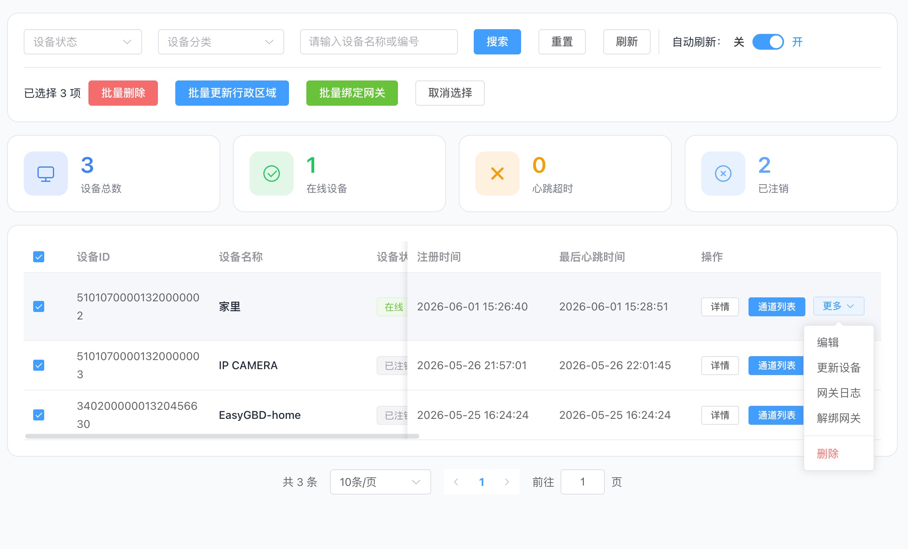
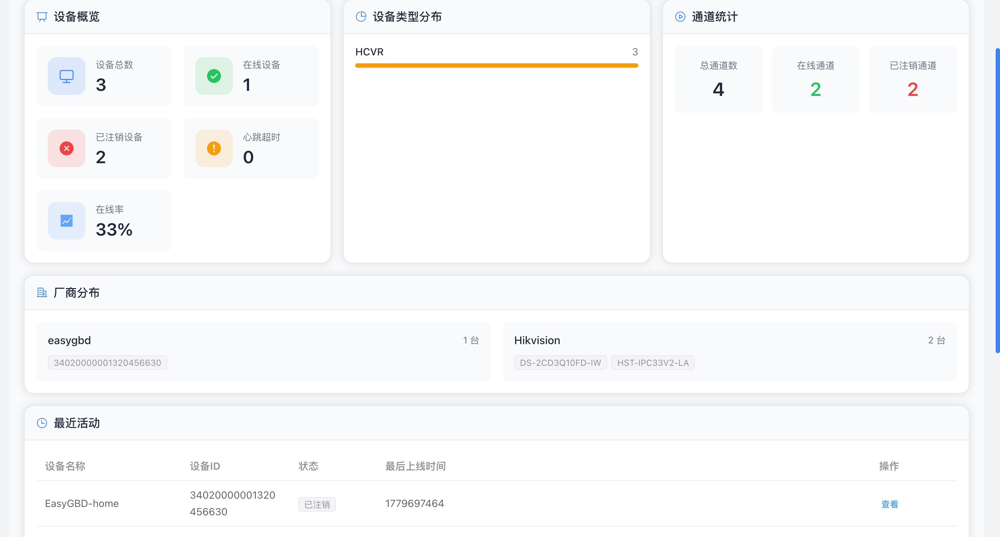
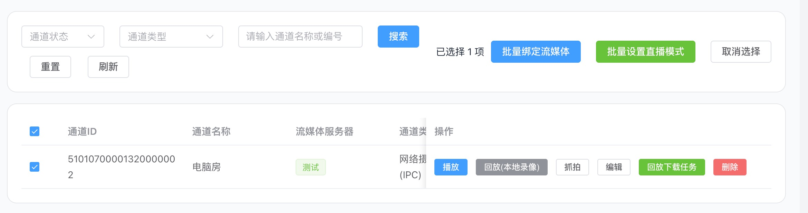
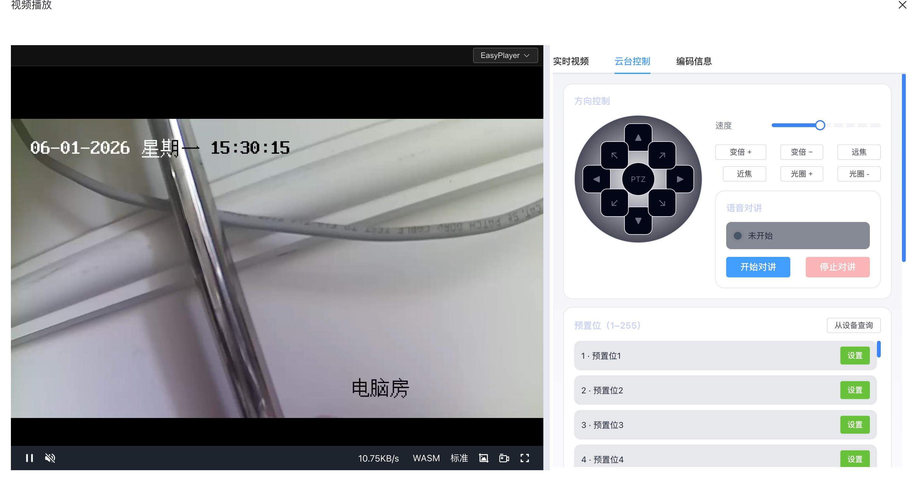
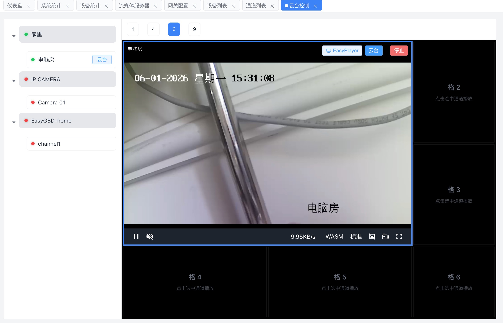
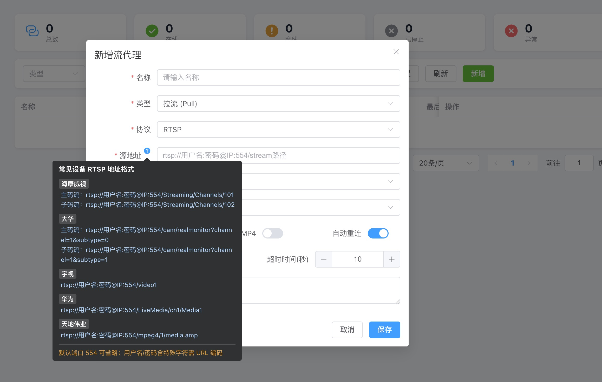
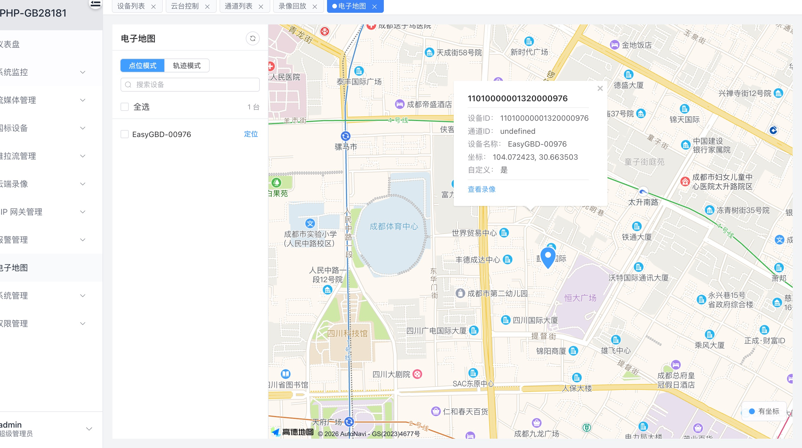
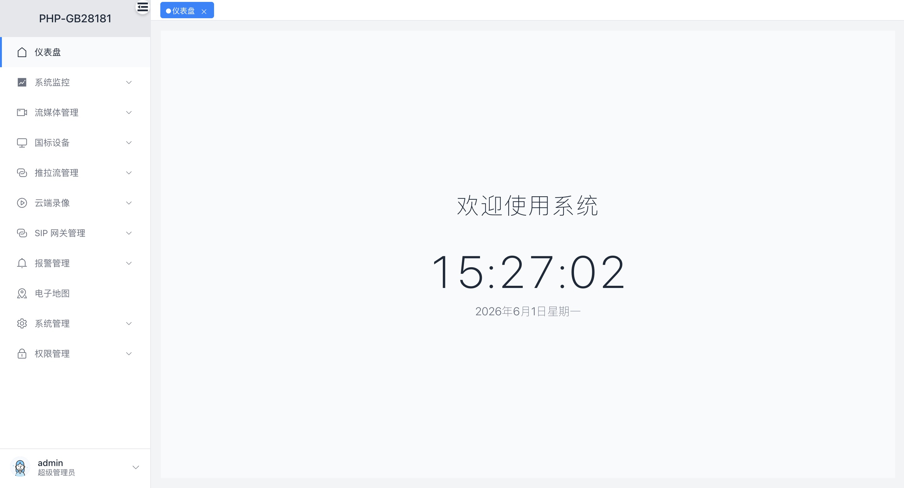
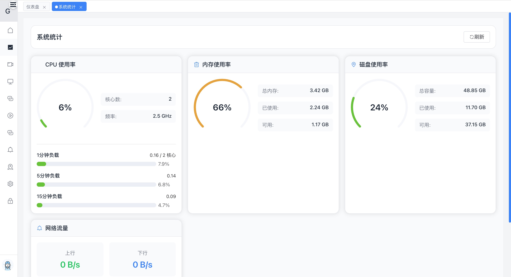
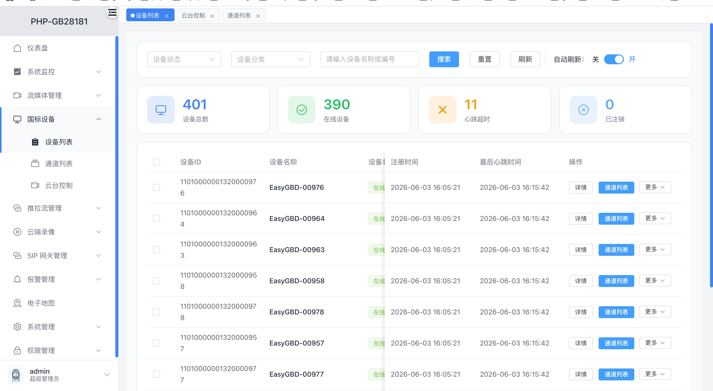
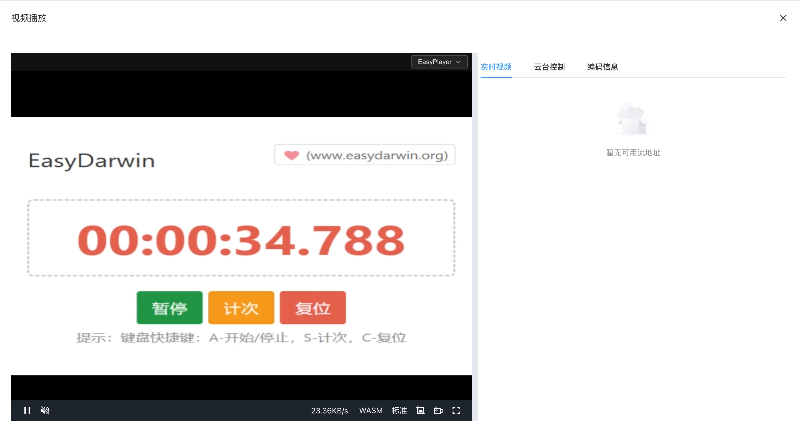
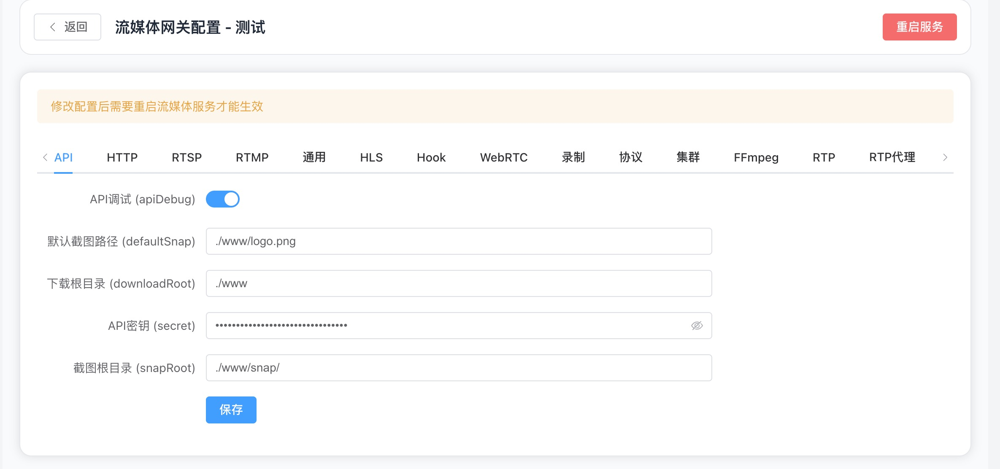


---
> 更多[>>>](./screenshots)
## 演示站点

- 演示地址：https://gbs.wanzij.cn
- 账号：admin / 密码：qwe123456@vr

## 核心功能

### 已完成的功能

- 完整的国标信令服务：设备直播、本地录像回放、本地录像回放下载、设备云台控制、设备位置上报等、报警事件
- 云端录像：录像查询、录像下载、录像回放器、录像合并
- 信令网关支持：TCP/UDP两种传输协议；集群部署；支持GB2011、GB2016、GB2022版本协议
- 流媒体服务：对接zlm/srs，支持国标摄像头rtp推流，集成非GB28181设备的拉流功能，实现除GB28181 Rtp流以外的其他流类型的拉取与转换
- 一张图：以高德/lefleat等地图sdk，实现设备一张图（设备点位、区域、预警）
- AI：视频文搜（近期整理好开源）
- openapi：完成了部分api，基本40%（开发者可以自行扩展，也可以联系我处理）

### 进行中功能

- 国标级联：扩展层已经实现完整的sipClient，php层面有完整的胶水类，待完善一个完整客户端长链接
- docker：后期完善docker镜像

---

## 项目初衷

2022-2023年期间，项目中频繁使用GB28181协议。当时基于C#技术栈，采用akStream作为网关解决方案。由于缺乏专门的国标后台管理系统，因此自主开发了一套管理平台，通过在akStream中进行二次开发，利用Webhook转发数据、封装API发送指令。

2023-2024年间，利用业余时间尝试使用Swoole编写网关，但发现SIP协议复杂度超出预期，最终放弃该方案。随后接触到eXosip库，在AI辅助下完成了网关开发，并通过API实现与PHP的通信交互。

在此契机下，决定借助AI开发一个专属的eXosip PHP扩展，将该扩展作为专用的SIP网络框架，业务逻辑则交由PHP这一"胶水语言"处理，由此诞生了当前的开源项目。

## 适用场景

本项目主要应用于以下智慧化场景：
- **智慧城市**：城市视频监控联网与管理
- **智慧农业**：农田、温室等农业场景监控
- **智慧安防**：安防监控系统集成与管理
- **智慧水利**：水利设施监控与调度管理

---

## 常见问题

### 功能测试说明

目前部分重要功能尚未充分测试，主要包括：

1. **设备报警事件**：由于当前不在相关行业，缺乏实际设备和测试场景
2. **级联功能**：同样受限于设备和环境条件

近期有几位行业小伙伴通过我之前发布的项目情况联系到我，然后提供测试环境并测试了设备管理、直播推流、云端录像等核心功能，反馈良好。对于上述未充分测试的功能，欢迎使用者在实际场景中遇到问题时联系作者，将提供技术支持和协助。

### 开源承诺与发展规划

本项目将保持长期开源状态，持续优化现有功能。未来计划开源更多专属功能，包括类似海康威视视频文搜系统的智能检索功能。目前该文搜系统已提供给甘肃某安防公司进行测试，整体效果良好。还有一套VR装修系统，能力和720云的基础功能一致，比较适合一些智慧农业、智慧城市项目里面需要在vr点位标记等场景里面集成自己的物联网等业务系统，还有就是也支持数字人讲解，这个有需要的用户可以联系作者。

同时欢迎有定制需求的用户联系作者，提供个性化开发服务。

### 未测试功能清单

以下功能已实现但需要更多实际场景验证：

- **语音对讲**：流程参考WVP项目，但缺乏国标设备进行完整测试
- **录像合并**：正在排期开发，主要涉及流媒体与国标API分离部署的场景测试
- **信令兼容性**：新老版本信令大部分已实现（参考WVP和AI搜索完善），但需要更多设备验证
- **报警事件**：已实现基础功能，需要实际设备测试验证

如有相关问题，欢迎提交Issue或联系作者。

---

## 快速开始

### 安装

#### 环境要求

- PHP >= 7.2
- Composer >= 2.0
- 内存至少 4GB （系统会使用ImageMagick处理全景图片，生成对应全景图片的低分辨率图：如果全景图片在20mb以上就会有很大的内存开销，如果内存不足会导致生成低分辨率图失败的可能）

#### composer 安装

```shell script
composer config -g --unset repos.packagist
```

#### 包安装

```shell script
composer install -vvv
```

#### 修改环境配置文件`.env`，将自己的环境参数配置（一定阅读`.env.example`的注释)

```shell script
cp .env.example .env
```

#### 系统初始化

- 数据迁移

```shell
bin/phpmig migrate 
```

- 系统初始化

```shell
php webman system:init 
```

#### 运行系统

```shell script
php start.php start 
php start.php stop
php start.php status
php start.php restart
# 守护进程启动
php start.php restart -d
php start.php reload
```

## gbs启动

### 网关和api在同一台服务器

- 如果是UDP监听：`cp config/gb28181.php.example config/gb28181.php`
- 如果是TCP监听：`cp config/gb28181_tcp.php.example config/gb28181_tcp.php`
- UDP启动：`php webman gb28181:server start`
- TCP启动：`php webman gb28181:server start --tcp`

### 网关和api不在同一台服务器
#### composer.json 和谐
```json
{
  "autoload": {
    "psr-4": {
      "Gb28181\\GateWay\\": "./Gb28181Gateway/src"
    },
    "files": [
    ]
  }
}
```

### 编写`gbs.php`


这部分参考：[gbs](./gb28181_server.php) 或者参考webman gb28181:server指令的处理

### 启动
```bash
php gbs.php start
```

## 线上部署实操

### step 1 - api
```bash
mkdir -p /www/gbs
cd /www/gbs
mkdir backend
mkdir frontend
cd backend
git clone https://github.com/wzj177/gbvr.git .
composer install -vvv
cp .env.example .env
# 修改配置
php webman system:init
cd ../frontend
# 上传dist.zip
unzip dist.zip
cp -r dist/* ./
rm -rf dist.zip  dist
cd ..
chown -R www-data:www-data frontend
# 服务启动
php webman restart -d
# 代码更新重载
php webman reload
```

- gbs 结构
```
drwxr-xr-x 15 root     root     4096 May 25 11:33 backend/
drwxr-xr-x  4 www-data www-data 4096 Jun  1 17:34 frontend/
```
- frontend 结构
```
drwxr-xr-x 2 www-data www-data 4096 May 24 20:57 assets/
-rw-r--r-- 1 www-data www-data 1265 May 24 20:57 index.html
drwxr-xr-x 4 www-data www-data 4096 May 24 20:57 static/
```
### step 2 - gbs
```bash
cd backend
# udp
cp config/gb28181.php.example config/gb28181.php
# 改网关配置
# 测试
php webman gb28181:server start -d
# tcp
cp config/gb28181_tcp.php.example config/gb28181_tcp.php
# 改网关配置
# 测试
php webman gb28181:server start --tcp -d
```

#### 使用supervisor启动

- udp
``conf
[program:gbs_server]
directory=/www/gbs/backend

command=php webman gb28181:server start -d
;command=php webman gb28181:server start 如果不开启debug
autostart=true
autorestart=true
startsecs=3
startretries=3

user=root
numprocs=1

redirect_stderr=true
stdout_logfile=/var/log/supervisor/gbs.out.log
stderr_logfile=/var/log/supervisor/gbs.err.log
stdout_logfile_maxbytes=50MB
stdout_logfile_backups=10

stopasgroup=true
killasgroup=true

; 关键：优雅停止
stopsignal=QUIT
stopwaitsecs=10

; 如果你的 stop 必须执行命令（备用方案）
; stopsignal=TERM
```

- tcp
```conf
[program:gbs_tcp_server]
directory=/www/gbs/backend

command=php webman gb28181:server start --tcp -d

autostart=true
autorestart=true
startsecs=3
startretries=3

user=root
numprocs=1

redirect_stderr=true
stdout_logfile=/var/log/supervisor/gbs_tcp.out.log
stderr_logfile=/var/log/supervisor/gbs_tcp.err.log
stdout_logfile_maxbytes=50MB
stdout_logfile_backups=10

stopasgroup=true
killasgroup=true

; 关键：优雅停止
stopsignal=QUIT
stopwaitsecs=10

; 如果你的 stop 必须执行命令（备用方案）
; stopsignal=TERM

```

### step 3 - zlm

#### zlm 下载编译
```
# 参考：https://docs.zlmediakit.com/zh/guide/install/start.html#_3-2%E3%80%81%E5%AE%89%E8%A3%85%E7%BC%96%E8%AF%91%E5%99%A8
git clone --depth 1 https://gitee.com/xia-chu/ZLMediaKit
git submodule update --init
openssl req -x509 -newkey rsa:2048 -keyout key.pem -out cert.pem -days 365 -nodes -subj "/C=CN/ST=Beijing/L=Beijing/O=MyCompany/CN=localhost"
cat key.pem cert.pem > ssl_prod.pem
rm -f key.pem cert.pem
mkdir -p build && cd build
cmake .. -DENABLE_WEBRTC=true
make -j4
mv ssl_prod.pem /www/gbs/backend/config/zlm
```
#### ffmpeg 安装
```shell
# ubuntu/debain
apt-get install ffmpeg
# centos/redhat
yum install ffmpeg
```
#### 使用supervisor启动
`/www/gbs/backend/config/zlm` 这个在项目目录里，可以自行配置

```conf
[program:zlmediakit]
; 直接指定二进制绝对路径和参数
command=/www/ZLMediaKit/release/linux/Debug/MediaServer -c /www/gbs/backend/config/zlm/config-prod.ini -s /www/gbs/backend/config/zlm/ssl_prod.pem

; 工作目录：确保 ZLM 能找到相对路径的资源（如 www 目录、日志目录等）
directory=/www/ZLMediaKit/release/linux/Debug

; 自动启动与重启
autostart=true
autorestart=true

; 启动成功判定时间（秒），给 ZLM 一点初始化时间
startsecs=5

; 运行用户：root 以便绑定 80/443 等特权端口
user=root

; 日志配置
stdout_logfile=/var/log/supervisor/zlmediakit.out.log
stderr_logfile=/var/log/supervisor/zlmediakit.err.log

; 停止信号
stopsignal=TERM
stopwaitsecs=10
```
---

- 如果不想自己去编译exosip扩展，建议在php-exosip仓库 release
  去下载指定版本，详情参考：[php-exosip](https://github.com/wzj177/php-exosip)。目前主要版本是php8.2，其他php版本开发者可以自己拉代码编译。


### step 4 - supervisor 命令
```bash
  supervisorctl reread
  supervisorctl update
  supervisorctl status
```

### step5 - gbs status
```bash
php webman gb28181:server status
php webman gb28181:server status --tcp
```

### step6 - nginx

```conf
upstream webman {
    # Webman 默认端口通常是 8787，请根据你的实际启动端口修改
    # 你提供的配置是 8886，这里保持一致
    server 127.0.0.1:8886;
    keepalive 10240;
}

server {
    listen 8888;
    server_name localhost; # 如果有域名，改为你的域名，如 example.com
    # Vue3 静态资源根目录
    root /www/gbs/frontend;
    index index.html;
    access_log /var/log/nginx/vue-gbs_access.log;
    # 错误日志：记录 Nginx 处理过程中的错误（如权限拒绝、上游连接失败等）
    error_log /var/log/nginx/vue-gbs_error.log;
    # 1. 处理 API 请求 (反向代理到 Webman)
    # ^~ 表示优先匹配，一旦匹配成功不再进行正则匹配
    location ^~ /api {
        proxy_set_header X-Real-IP $remote_addr;
        proxy_set_header Host $http_host;
        proxy_set_header X-Forwarded-Proto $scheme;
        proxy_http_version 1.1;
        proxy_set_header Connection "";

        # 如果请求的文件不存在（通常 API 都是虚拟路径，肯定不存在），则转发
        # 注意：对于纯 API 代理，通常不需要 if (!-f)，直接 proxy_pass 即可
        # 但保留你的逻辑也没问题
        if (!-f $request_filename) {
            proxy_pass http://webman;
        }
    }

    # 2. 处理 Vue Router 的 History 模式
    # 如果访问的路径不是文件也不是目录，全部重定向到 index.html
    location / {
        try_files $uri $uri/ /index.html;
    }

    # 3. 静态资源缓存优化 (可选)
    location ~* \.(js|css|png|jpg|jpeg|gif|ico|svg|woff|woff2|ttf|eot)$ {
        expires 30d;
        add_header Cache-Control "public, immutable";
        access_log off;
    }

    # 4. 禁止访问隐藏文件 (.git, .env 等)
    location ~ /\. {
        deny all;
        access_log off;
        log_not_found off;
    }
}

```

### step7 - 端口开放(如果自己改了，以自己的为准)

```
tcp/udp port range : 30000-35000 | 50000-60000
tcp/udp port: 15060
tcp:
tcp        0      0 0.0.0.0:8888            0.0.0.0:*               LISTEN      135408/nginx: maste
tcp6       0      0 :::19350                :::*                    LISTEN      134811/MediaServer
tcp6       0      0 :::3000                 :::*                    LISTEN      134811/MediaServer
tcp6       0      0 :::3001                 :::*                    LISTEN      134811/MediaServer
tcp6       0      0 :::8843                 :::*                    LISTEN      134811/MediaServer
tcp6       0      0 :::8887                 :::*                    LISTEN      134811/MediaServer
tcp6       0      0 :::8600                 :::*                    LISTEN      134811/MediaServer
tcp6       0      0 :::10000                :::*                    LISTEN      134811/MediaServer
tcp6       0      0 :::3478                 :::*                    LISTEN      134811/MediaServer
tcp6       0      0 :::5540                 :::*                    LISTEN      134811/MediaServer

```


---

## 相关仓库

| 仓库                                                         | 说明                                   |
|------------------------------------------------------------|--------------------------------------|
| [php-exosip](https://github.com/wzj177/php-exosip)         | PHP C 扩展，封装 eXosip2 提供 SIP 服务端/客户端能力 |
| [PHP-GB28181-UI](https://github.com/wzj177/PHP-GB28181-UI) | 管理后台前端（Vue.js），设备管理、实时预览、云台控制等       |


## 友情链接

[](https://linux.do)