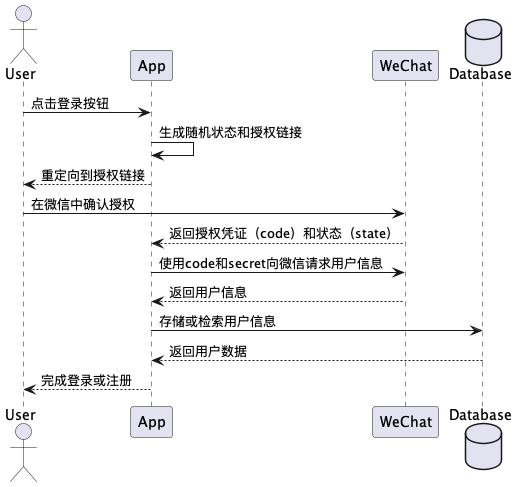

微信社会化登录流程通常包括以下步骤：

用户点击登录按钮，选择使用微信登录。
应用生成带有随机状态的授权链接，并将用户重定向到该链接。
用户在微信客户端中确认授权。
微信返回授权凭证（code）和状态（state）到应用的回调地址。
应用使用授权凭证和应用密钥向微信服务器发送请求，获取用户的唯一标识（openid）等信息。
应用根据获取的用户信息，完成登录或注册操作。
下面是使用 easywechat（一个PHP的微信SDK）的简化示例代码：

```php
require 'vendor/autoload.php';

use EasyWeChat\Factory;

$config = [
'app_id' => 'your-app-id',
'secret' => 'your-app-secret',
'oauth' => [
'scopes'   => ['snsapi_login'],
'callback' => 'your-callback-url',
],
];

$app = Factory::officialAccount($config);

// 生成授权链接并重定向用户到该链接
$oauth = $app->oauth;
$redirectUrl = $oauth->redirect()->getTargetUrl();
header("Location: $redirectUrl");
exit;

// 在回调地址处理用户授权回调
$user = $oauth->user();

// 获取用户信息
$openid = $user->getId();
$nickname = $user->getNickname();
$avatar = $user->getAvatar();

// 进行登录或注册操作
// ...
```

## 流程图如下:

