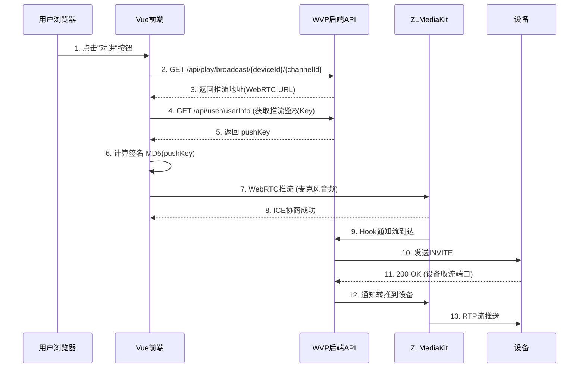

根据代码搜索结果，我详细解析**前端是如何传输音频流到后端接口的**：

---

# 🎙️ 前端语音对讲传输流程详解

## 完整交互流程图



---

## 第一阶段：前端调用后端接口获取推流地址

### 1. 用户点击"对讲"按钮

```vue
<!-- web/src/views/dialog/devicePlayer.vue -->
<template>
  <el-button 
    :type="getBroadcastStatus()" 
    @click="broadcastStatusClick">
    {{ broadcastStatus === 1 ? '停止对讲' : '语音对讲' }}
  </el-button>
</template>

<script>
export default {
  data() {
    return {
      broadcastStatus: -1,  // -1:未开始, 0:连接中, 1:对���中
      broadcastMode: false, // false=对讲, true=喊话
      broadcastRtc: null    // WebRTC客户端实例
    }
  }
}
</script>
```

---

### 2. 调用后端API获取推流地址

```javascript
// web/src/views/dialog/devicePlayer.vue
broadcastStatusClick() {
  if (this.broadcastStatus === -1) {
    this.broadcastStatus = 0; // 设置为连接中状态
    
    // ✅ 调用Vuex Action发起请求
    this.$store.dispatch('play/broadcastStart', [
      this.deviceId,     // 设备ID
      this.channelId,    // 通道ID
      this.broadcastMode // false=对讲
    ])
    .then(data => {
      const streamInfo = data.streamInfo;
      
      // 根据协议选择推流地址
      if (document.location.protocol.includes('https')) {
        this.startBroadcast(streamInfo.rtcs); // WebRTC over TLS
      } else {
        this.startBroadcast(streamInfo.rtc);  // WebRTC
      }
    })
    .catch(error => {
      this.$message.error(error);
      this.broadcastStatus = -1;
    });
  }
}
```

---

### 3. Vuex Action发起HTTP请求

```javascript
// web/src/store/modules/play.js
const actions = {
  broadcastStart({ commit }, [deviceId, channelId, broadcastMode]) {
    return new Promise((resolve, reject) => {
      // ✅ HTTP GET请求后端接口
      broadcastStart({ 
        deviceId, 
        channelId, 
        broadcastMode 
      })
      .then(response => {
        resolve(response.data); // 返回包含streamInfo的数据
      })
      .catch(error => {
        reject(error);
      });
    });
  }
}
```

```javascript
// web/src/api/play.js
export function broadcastStart({ deviceId, channelId, broadcastMode }) {
  return request({
    method: 'get',
    url: `/api/play/broadcast/${deviceId}/${channelId}`,
    params: {
      timeout: 30,
      broadcastMode: broadcastMode  // false=对讲模式
    }
  });
}
```

---

### 4. 后端返回推流地址

**后端响应示例:**
```json
{
  "code": 0,
  "msg": "success",
  "data": {
    "streamInfo": {
      "app": "talk",
      "stream": "34020000001320000001_34020000001320000001",
      "rtc": "webrtc://192.168.1.100:8443/talk/34020000001320000001_34020000001320000001",
      "rtcs": "webrtcs://192.168.1.100:8443/talk/34020000001320000001_34020000001320000001",
      "rtsp": "rtsp://192.168.1.100:554/talk/34020000001320000001_34020000001320000001",
      "rtmp": "rtmp://192.168.1.100:1935/talk/34020000001320000001_34020000001320000001"
    },
    "codec": "PCMA",
    "app": "talk",
    "stream": "34020000001320000001_34020000001320000001"
  }
}
```

**推流地址格式:**
```
webrtc://{zlm_ip}:{port}/{app}/{stream}
```
- **app**: `talk` (对讲) / `broadcast` (喊话)
- **stream**: `{deviceId}_{channelId}`

---

## 第二阶段：获取推流鉴权并构建完整URL

### 5. 获取用户推流Key

```javascript
// web/src/views/dialog/devicePlayer.vue
startBroadcast(url) {
  // ✅ 获取推流鉴权Key
  this.$store.dispatch('user/getUserInfo')
    .then((data) => {
      if (data === null) {
        this.broadcastStatus = -1;
        return;
      }
      
      const pushKey = data.pushKey; // 例如: "TWSYFgYJOQWB4ftgeYut8DW4wbs7pQnj"
      
      // ✅ 计算签名: MD5(pushKey)
      const sign = crypto.createHash('md5')
                        .update(pushKey, 'utf8')
                        .digest('hex');
      
      // ✅ 拼接完整推流URL
      url += '&sign=' + sign;
      
      console.log('开始语音喊话： ' + url);
      // 最终URL示例:
      // webrtc://192.168.1.100:8443/talk/34020000001320000001_34020000001320000001?sign=41db35390ddad33f83944f44b8b75ded
      
      this.initWebRTCClient(url);
    });
}
```

**推流鉴权机制:**
- 用户在登录时后端生成`pushKey`
- 前端使用MD5(pushKey)生成签名
- ZLM通过签名验证推流权限

---

## 第三阶段：使用WebRTC推送音频流

### 6. 初始化WebRTC客户端

```javascript
// web/src/views/dialog/devicePlayer.vue
initWebRTCClient(url) {
  // ✅ 创建ZLMediaKit WebRTC客户端
  this.broadcastRtc = new ZLMRTCClient.Endpoint({
    debug: true,               // 打印调试日志
    zlmsdpUrl: url,           // 推流地址
    simulecast: false,        // 不使用联播
    useCamera: false,         // 不使用摄像头
    audioEnable: true,        // ✅ 启用音频 (关键!)
    videoEnable: false,       // ✅ 禁用视频
    recvOnly: false,          // ✅ 发送模式 (不是接收)
    
    // 音频参数配置
    audioCodec: 'opus',       // 前端采集使用Opus编码
    audioSampleRate: 48000,   // 浏览器默认采样率
    audioChannels: 2          // 立体声
  });
  
  // 监听WebRTC事件
  this.setupWebRTCEvents();
}
```

---

### 7. 浏览器采集麦克风音频

**WebRTC底层流程:**

```javascript
// ZLMRTCClient内部实现 (简化版)
async function startAudioCapture() {
  // 1. 请求麦克风权限
  const stream = await navigator.mediaDevices.getUserMedia({
    audio: {
      echoCancellation: true,  // 回声消除
      noiseSuppression: true,  // 降噪
      autoGainControl: true,   // 自动增益
      sampleRate: 48000        // 采样率
    },
    video: false
  });
  
  // 2. 创建RTCPeerConnection
  const pc = new RTCPeerConnection({
    iceServers: [{ urls: 'stun:stun.l.google.com:19302' }]
  });
  
  // 3. 添加音频轨道
  stream.getAudioTracks().forEach(track => {
    pc.addTrack(track, stream);
  });
  
  // 4. 创建Offer
  const offer = await pc.createOffer();
  await pc.setLocalDescription(offer);
  
  // 5. 发送SDP到ZLM服务器
  const response = await fetch(zlmsdpUrl, {
    method: 'POST',
    headers: { 'Content-Type': 'application/json' },
    body: JSON.stringify({ sdp: offer.sdp, type: offer.type })
  });
  
  // 6. 接收ZLM的Answer
  const answer = await response.json();
  await pc.setRemoteDescription(new RTCSessionDescription(answer));
  
  // 7. ICE候选交换
  pc.onicecandidate = event => {
    if (event.candidate) {
      // 发送ICE候选到ZLM
    }
  };
}
```

---

### 8. WebRTC事件监听

```javascript
// web/src/views/dialog/devicePlayer.vue
setupWebRTCEvents() {
  // ✅ 不支持WebRTC
  this.broadcastRtc.on(ZLMRTCClient.Events.WEBRTC_NOT_SUPPORT, (e) => {
    console.error('不支持webrtc', e);
    this.$message.error('不支持webrtc, 无法进行语音喊话');
    this.broadcastStatus = -1;
  });
  
  // ✅ ICE协商失败
  this.broadcastRtc.on(ZLMRTCClient.Events.WEBRTC_ICE_CANDIDATE_ERROR, (e) => {
    console.error('ICE 协商出错');
    this.$message.error('ICE 协商出错');
    this.broadcastStatus = -1;
  });
  
  // ✅ 获取本地流成功
  this.broadcastRtc.on(ZLMRTCClient.Events.WEBRTC_ON_LOCAL_STREAM, (stream) => {
    console.log('麦克风音频采集成功', stream);
    this.broadcastStatus = 1; // 设置为对讲中
  });
  
  // ✅ Offer/Answer交换失败
  this.broadcastRtc.on(ZLMRTCClient.Events.WEBRTC_OFFER_ANWSER_EXCHANGE_FAILED, (e) => {
    console.error('offer anwser 交换失败', e);
    if (e.code == -400 && e.msg == '流不存在') {
      this.$message.error('推流失败，流不存在');
    }
    this.broadcastStatus = -1;
  });
  
  // ✅ 连接成功
  this.broadcastRtc.on(ZLMRTCClient.Events.WEBRTC_ON_CONNECTION_STATE_CHANGE, (state) => {
    if (state === 'connected') {
      console.log('WebRTC连接成功，开始推流');
      this.broadcastStatus = 1;
    }
  });
}
```

---

## 音频流传输详细过程

### 📊 数据流转换链路

```
浏览器麦克风 
  ↓ (PCM原始音频)
MediaStream API 
  ↓ (AudioTrack)
WebRTC Encoder 
  ↓ (Opus编码, 48kHz)
SRTP加密 
  ↓ (UDP/TCP传输)
ZLMediaKit 
  ↓ (转码为PCMA, 8kHz)
RTP推流 
  ↓ (UDP/TCP)
设备 
  ↓ (解码播放)
扬声器
```

---

### 🔊 音频参数对比

| 阶段 | 编码格式 | 采样率 | 声道 | 传输协议 |
|-----|---------|--------|------|---------|
| **浏览器采集** | PCM | 48000 Hz | Stereo | - |
| **WebRTC推流** | **Opus** | 48000 Hz | Stereo | **SRTP** |
| **ZLM接收** | Opus | 48000 Hz | Stereo | SRTP |
| **ZLM转码** | **PCMA** | **8000 Hz** | **Mono** | - |
| **RTP推流** | PCMA | 8000 Hz | Mono | **RTP** |
| **设备接收** | PCMA | 8000 Hz | Mono | RTP |

**转码原因:**
- 国标GB28181要求使用**PCMA(G.711 A-law)**编码
- 采样率必须为**8000 Hz**（电话音质）
- **单声道**（减少带宽）

---

## 关键代码片段详解

### ZLM Hook接收推流通知

```javascript
// ZLM收到WebRTC推流后，触发Hook通知WVP
POST http://wvp-ip:18080/index/hook/on_publish
{
  "mediaServerId": "zlm_server_1",
  "app": "talk",
  "stream": "34020000001320000001_34020000001320000001",
  "params": "?sign=41db35390ddad33f83944f44b8b75ded",
  "schema": "webrtc",
  "vhost": "__defaultVhost__",
  "ip": "192.168.1.50",      // 前端IP
  "port": 45678,
  "id": "stream_id_12345",
  "originType": 3,            // 3=WebRTC推流
  "originTypeStr": "rtc_push"
}
```

---

### WVP接收Hook并发起INVITE

```java
// PlayServiceImpl.onApplicationEvent()
@EventListener
public void onApplicationEvent(MediaArrivalEvent event) {
    if ("talk".equals(event.getApp())) {
        String[] parts = event.getStream().split("_");
        String deviceId = parts[0];
        String channelId = parts[1];
        
        log.info("[语音对讲] 收到前端推流, device: {}, channel: {}", 
                 deviceId, channelId);
        
        // 向设备发送INVITE，建立对讲会话
        Device device = deviceService.getDeviceByDeviceId(deviceId);
        DeviceChannel channel = deviceChannelService.getOneForSource(deviceId, channelId);
        
        SendRtpInfo sendRtpInfo = sendRtpServerService.queryByChannelId(
            channel.getId(), device.getDeviceId()
        );
        
        // ✅ 通知ZLM向设备推流
        mediaServerService.startSendRtpStream(mediaServer, sendRtpInfo);
    }
}
```

---

## 完整的推流URL示例

```
webrtc://192.168.1.100:8443/talk/34020000001320000001_34020000001320000001?sign=41db35390ddad33f83944f44b8b75ded
```

**URL组成部分:**
- **协议**: `webrtc://` (或 `webrtcs://` for TLS)
- **服务器**: `192.168.1.100:8443` (ZLM的WebRTC端口)
- **App**: `talk` (对讲) / `broadcast` (喊话)
- **Stream**: `{deviceId}_{channelId}`
- **签名**: `sign={MD5(pushKey)}`

---

## 🎯 总结

**前端传输方式: WebRTC**

1. **协议**: WebRTC (SRTP加密传输)
2. **编码**: 浏览器采用Opus编码
3. **传输**: 通过UDP/TCP发送RTP包到ZLM
4. **转码**: ZLM将Opus转为PCMA给设备
5. **鉴权**: MD5签名验证

**关键优势:**
- ✅ 低延迟 (< 100ms)
- ✅ 自动NAT穿透 (STUN/TURN)
- ✅ 加密传输 (SRTP)
- ✅ 自适应码率
- ✅ 回声消除/降噪

这就是前端通过WebRTC协议将麦克风音频实时推送到ZLM，再由WVP协调转发给设备的完整流程! 🎤