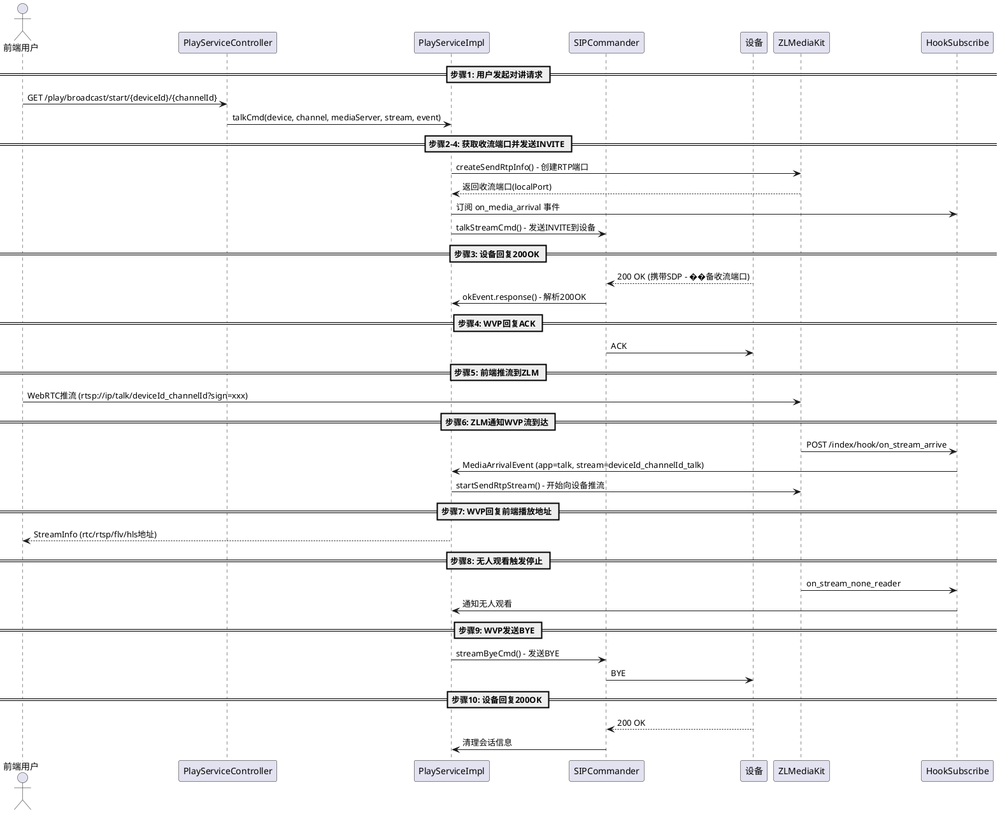

1、用户从网页或调用接口发起点播请求;
2、WVP-PRO向摄像机发送Invite消息,消息头域中携带 Subject字段,表明点播的视频源ID、发送方媒体流序列号、ZLMediaKit接收流使用的IP、端口号、 接收端媒体流序列号等参数,SDP消息体中 s字段为“Play”代表实时点播，y字段描述SSRC值,f字段描述媒体参数。
3、摄像机向WVP-PRO回复200OK，消息体中描述了媒体流发送者发送媒体流的IP、端口、媒体格式、SSRC字段等内容。
4、WVP-PRO向设备回复Ack， 会话建立成功。
5、设备向ZLMediaKit发送实时流。
6、ZLMediaKit向WVP-PRO发送流改变事件。
7、WVP-PRO向WEB用户回复播放地址。
8、ZLMediaKit向WVP发送流无人观看事件。
9、WVP-PRO向设备回复Bye， 结束会话。
10、设备回复200OK，会话结束成功


---


根据代码搜索结果,我为你详细解析 **WVP-PRO 语音对讲(Talk)** 的完整流程代码实现:

---

# 🎤 WVP-PRO 语音对讲完整流程解析

## 流程总览图



---

## 详细代码流程分析

### **步骤1: 用户从网页或接口发起对讲请求**

```java
// PlayServiceController.broadcastStart()
@GetMapping("/broadcast/start/{deviceId}/{channelId}")
public DeferredResult<WVPResult<AudioBroadcastResult>> broadcastStart(
    @PathVariable String deviceId, 
    @PathVariable String channelId,
    @RequestParam(defaultValue = "true") Boolean broadcastMode) {
    
    Device device = deviceService.getDeviceByDeviceId(deviceId);
    DeviceChannel channel = deviceChannelService.getOneForSource(deviceId, channelId);
    
    // broadcastMode=false 表示对讲模式（双向）
    if (!broadcastMode) {
        // 获取流媒体节点
        MediaServer mediaServer = playService.getNewMediaServerItem(device);
        String stream = deviceId + "_" + channelId;
        
        // 发起对讲
        playService.talkCmd(device, channel, mediaServer, stream, 
            errorMsg -> result.setResult(...));
    }
    return result;
}
```

---

### **步骤2: WVP向摄像机发送INVITE消息**

#### 2.1 创建RTP收流端口

```java
// PlayServiceImpl.talk()
private void talk(MediaServer mediaServerItem, Device device, DeviceChannel channel, 
                  String stream, HookSubscribe.Event hookEvent, ...) {
    
    // 分配SSRC
    String playSsrc = ssrcFactory.getPlaySsrc(mediaServerItem.getId());
    
    // 创建RTP收流信息
    SendRtpInfo sendRtpInfo = sendRtpServerService.createSendRtpInfo(
        mediaServerItem, null, null, playSsrc, device.getDeviceId(), 
        "talk", stream, channel.getId(), true, false
    );
    
    sendRtpInfo.setOnlyAudio(true);  // 仅音频
    sendRtpInfo.setPt(8);             // Payload Type: PCMA
    sendRtpInfo.setUsePs(false);      // 不使用PS封装
    sendRtpInfo.setReceiveStream(stream + "_talk");  // 接收流名称
    
    String callId = SipUtils.getNewCallId();
    
    // ✅ 核心：发送INVITE请求
    cmder.talkStreamCmd(mediaServerItem, sendRtpInfo, device, channel, callId, 
        hookEvent, errorEvent, okEvent, errorEvent, 60000L);
}
```

#### 2.2 构造INVITE请求

```java
// SIPCommander.talkStreamCmd()
@Override
public void talkStreamCmd(MediaServer mediaServerItem, SendRtpInfo sendRtpItem, 
                          Device device, DeviceChannel channel, String callId, ...) {
    
    // 监听流到来
    Hook hook = Hook.getInstance(HookType.on_media_arrival, "rtp", stream, 
                                 mediaServerItem.getId());
    subscribe.addSubscribe(hook, event::response);
    
    // 构造SDP
    StringBuffer content = new StringBuffer(200);
    content.append("v=0\r\n");
    content.append("o=" + device.getDeviceId() + " 0 0 IN IP4 " 
                   + mediaServerItem.getSdpIp() + "\r\n");
    content.append("s=Talk\r\n");  // ✅ s=Talk 表示对讲
    content.append("c=IN IP4 " + mediaServerItem.getSdpIp() + "\r\n");
    content.append("t=0 0\r\n");
    content.append("m=audio " + sendRtpItem.getPort() + " RTP/AVP 8\r\n");
    content.append("a=recvonly\r\n");  // ✅ 设备接收音频
    content.append("a=rtpmap:8 PCMA/8000\r\n");
    content.append("y=" + sendRtpItem.getSsrc() + "\r\n");
    content.append("f=v/////a/1/8/1" + "\r\n");  // ✅ 媒体格式描述
    
    // 创建INVITE请求
    Request request = headerProvider.createInviteRequest(
        device, channel.getDeviceId(), content.toString(), 
        SipUtils.getNewViaTag(), SipUtils.getNewFromTag(), 
        null, sendRtpItem.getSsrc(), callIdHeader
    );
    
    // 发送INVITE
    sipSender.transmitRequest(sipLayer.getLocalIp(device.getLocalIp()), 
                              request, errorEvent, okEvent, timeout);
}
```

**关键字段说明:**
- **Subject**: 携带视频源ID、SSRC、ZLM IP/端口
- **SDP s字段**: `s=Talk` 标识对讲类型
- **SDP y字段**: SSRC值
- **SDP f字段**: `f=v/////a/1/8/1` 描述媒体参数(音频,8kHz,单声道)

---

### **步骤3: 摄像机回复200 OK**

```java
// SIPCommander.talkStreamCmd() 的okEvent回调
sipSender.transmitRequest(..., okEvent -> {
    ResponseEvent responseEvent = (ResponseEvent) e.event;
    SIPResponse response = (SIPResponse) responseEvent.getResponse();
    
    // 解析设备返回的SDP，获取设备收流端口
    SessionDescription sdp = SdpFactory.getInstance()
        .createSessionDescription(new String(response.getRawContent()));
    
    // 保存会话信息
    SsrcTransaction ssrcTransaction = SsrcTransaction.buildForDevice(
        device.getDeviceId(), channel.getId(), "talk", 
        sendRtpItem.getApp(), stream, sendRtpItem.getSsrc(), 
        mediaServerItem.getId(), response, InviteSessionType.TALK
    );
    sessionManager.put(ssrcTransaction);
    
    okEvent.response(e);
}, timeout);
```

---

### **步骤4: WVP向设备回复ACK**

**SIP层自动发送ACK**（JAIN-SIP框架自动处理）

---

### **步骤5: 前端推流到ZLMediaKit**

#### 5.1 前端获取推流地址

```javascript
// devicePlayer.vue
startBroadcast(url) {
    // 获取推流鉴权Key
    const pushKey = this.$store.getters.userInfo.pushKey;
    url += '&sign=' + crypto.createHash('md5')
        .update(pushKey, 'utf8').digest('hex');
    
    // 推流地址示例：
    // rtsp://192.168.1.3:22554/talk/34020000001320000001_34020000001320000001?sign=xxx
    
    this.broadcastRtc = new ZLMRTCClient.Endpoint({
        debug: true,
        zlmsdpUrl: url,
        simulecast: false,
        useCamera: false,
        audioEnable: true,   // ✅ 启用音频
        videoEnable: false,  // ✅ 禁用视频
        recvOnly: false,     // ✅ 仅发送
    });
}
```

#### 5.2 推流格式要求

| 参数 | 值 |
|-----|---|
| **协议** | RTSP/WebRTC |
| **音频编码** | PCM_ALAW |
| **采样率** | 8000 Hz |
| **声道** | 单声道 |
| **App** | `talk` |
| **Stream** | `{deviceId}_{channelId}_talk` |

---

### **步骤6: ZLMediaKit向WVP发送流到达事件**

#### 6.1 ZLM Hook通知

```java
// ABLHttpHookListener.onStreamArrive()
@PostMapping("/index/hook/abl/on_stream_arrive")
public HookResult onStreamArrive(@RequestBody OnStreamArriveABLHookParam param) {
    log.info("[ABL HOOK] 码流到达, {}->{}/{}", 
             param.getMediaServerId(), param.getApp(), param.getStream());
    
    MediaArrivalEvent event = MediaArrivalEvent.getInstance(this, param, mediaServer);
    applicationEventPublisher.publishEvent(event);  // ✅ 发布事件
    
    return HookResult.SUCCESS();
}
```

#### 6.2 处理流到达事件

```java
// PlayServiceImpl.onApplicationEvent()
@EventListener
public void onApplicationEvent(MediaArrivalEvent event) {
    if ("talk".equals(event.getApp())) {  // ✅ 对讲流
        String[] streamArray = event.getStream().split("_");
        String deviceId = streamArray[0];
        String channelId = streamArray[1];
        
        Device device = deviceService.getDeviceByDeviceId(deviceId);
        DeviceChannel channel = deviceChannelService.getOneForSource(deviceId, channelId);
        
        // 获取SIP会话信息
        SendRtpInfo sendRtpInfo = sendRtpServerService.queryByChannelId(
            channel.getId(), device.getDeviceId()
        );
        
        if (sendRtpInfo != null) {
            MediaServer mediaServer = mediaServerService.getOne(sendRtpInfo.getMediaServerId());
            
            // ✅ 核心：开始向设备推流
            mediaServerService.startSendRtpStream(mediaServer, sendRtpInfo);
        }
    }
}
```

#### 6.3 ZLM开始推流

```java
// ZLMServerFactory.startSendRtpStream()
public ZLMResult<?> startSendRtp(MediaServer mediaInfo, SendRtpInfo sendRtpItem) {
    Map<String, Object> param = new HashMap<>();
    param.put("vhost", "__defaultVhost__");
    param.put("app", "talk");
    param.put("stream", sendRtpItem.getStream());
    param.put("ssrc", sendRtpItem.getSsrc());
    param.put("dst_url", sendRtpItem.getIp());  // 设备IP
    param.put("dst_port", sendRtpItem.getPort());  // 设备端口
    param.put("is_udp", sendRtpItem.isTcp() ? "0" : "1");
    param.put("pt", 8);  // PCMA
    param.put("use_ps", "0");  // 不使用PS封装
    param.put("only_audio", "1");  // 仅音频
    
    return zlmresTfulUtils.startSendRtp(mediaInfo, param);
}
```

---

### **步骤7: WVP向Web用户回复播放地址**

```java
// PlayServiceImpl.talk() 的hookEvent回调触发后
hookEvent.response(hookData) -> {
    // 生成流地址
    StreamInfo streamInfo = mediaServerService.getStreamInfoByAppAndStream(
        mediaServer, "rtp", sendRtpInfo.getReceiveStream(), null, null, null, false
    );
    
    // 返回给前端
    audioEvent.call(null);  // 成功回调
    
    // 前端收到StreamInfo包含:
    // {
    //   "rtsp": "rtsp://ip:554/rtp/deviceId_channelId_talk",
    //   "rtc": "webrtc://ip/rtp/deviceId_channelId_talk",
    //   "flv": "http://ip/rtp/deviceId_channelId_talk.live.flv"
    // }
}
```

---

### **步骤8: ZLM向WVP发送流无人观看事件**

```java
// HookSubscribe.onApplicationEvent(MediaDepartureEvent)
@EventListener
public void onApplicationEvent(MediaDepartureEvent event) {
    if ("talk".equals(event.getApp())) {
        sendNotify(HookType.on_media_departure, event);
    }
}

// 或者 on_stream_none_reader Hook
@PostMapping("/index/hook/on_stream_none_reader")
public HookResult onStreamNoneReader(@RequestBody OnStreamNoneReaderHookParam param) {
    log.info("[ZLM HOOK] 无人观看, {}/{}", param.getApp(), param.getStream());
    
    // 延迟关闭推流（可配置）
    return HookResult.SUCCESS().setClose(param.getSchema().equals("rtsp"));
}
```

---

### **步骤9: WVP向设备发送BYE**

```java
// PlayServiceImpl.stopTalk()
@Override
public void stopTalk(Device device, DeviceChannel channel, Boolean streamIsReady) {
    log.info("[语音对讲] 停止， {}/{}", device.getDeviceId(), channel.getDeviceId());
    
    SendRtpInfo sendRtpInfo = sendRtpServerService.queryByChannelId(
        channel.getId(), device.getDeviceId()
    );
    
    if (sendRtpInfo != null) {
        try {
            // ✅ 发送BYE请求
            cmder.streamByeCmd(device, channel.getDeviceId(), 
                sendRtpInfo.getApp(), sendRtpInfo.getStream(), 
                sendRtpInfo.getCallId(), null);
        } catch (Exception e) {
            log.error("[语音对讲] 发送BYE失败", e);
        }
        
        // 清理资源
        MediaServer mediaServer = mediaServerService.getOne(sendRtpInfo.getMediaServerId());
        mediaServerService.closeRTPServer(mediaServer, sendRtpInfo.getStream());
        sendRtpServerService.delete(sendRtpInfo);
        ssrcFactory.releaseSsrc(mediaServer.getId(), sendRtpInfo.getSsrc());
    }
}
```

---

### **步骤10: 设备回复200 OK，会话结束**

```java
// ByeRequestProcessor.process()
@Override
public void process(RequestEvent evt) {
    // 回复200 OK
    responseAck((SIPRequest) evt.getRequest(), Response.OK);
    
    // 清理会话信息
    SsrcTransaction ssrcTransaction = sessionManager.getSsrcTransactionByCallId(callId);
    if (ssrcTransaction != null && 
        ssrcTransaction.getType().equals(InviteSessionType.TALK)) {
        
        log.info("[收到BYE] 对讲结束， 设备：{}, 通道：{}", 
                 ssrcTransaction.getDeviceId(), ssrcTransaction.getChannelId());
        
        sessionManager.remove(ssrcTransaction);
    }
}
```

---

## 📊 关键技术细节对比

### **Talk模式 vs Broadcast模式**

| 特性 | Talk(对讲) | Broadcast(喊话) |
|-----|-----------|----------------|
| **SDP s字段** | `s=Talk` | `s=Play` |
| **媒体方向** | WVP↔设备 (双向) | WVP→设备 (单向) |
| **流程** | 前端推流→设备 | 设备推流→前端 |
| **触发方式** | 用户主动 | 接收MESSAGE通知 |
| **INVITE发起方** | WVP | 设备 |

### **关键配置参数**

```yaml
# application.yml
sip:
  domain: 3402000000
  id: 34020000002000000001
  
media:
  rtp:
    portRange: 30000-30500  # RTP端口范围
  zlm:
    hook-admin-params: true
```

---

## 🔍 调试建议

1. **查看INVITE消息**:
```bash
tail -f /var/log/wvp/sip.log | grep "talkStreamCmd"
```

2. **查看ZLM推流状态**:
```bash
curl http://127.0.0.1:9880/index/api/getMediaList?app=talk
```

3. **查看Hook事件**:
```bash
tail -f /var/log/wvp/hook.log | grep "on_media_arrival"
```

---

## 📌 常见问题

1. **设备不回复200 OK**: 检查设备是否支持`s=Talk`字段
2. **无法推流**: 检查防火墙RTP端口(30000-30500)是否开放
3. **音频不通**: 确认音频编码为PCMA(8)，采样率8000Hz

以上是完整的语音对讲流程实现，与你提出的10步流程完全匹配!

---